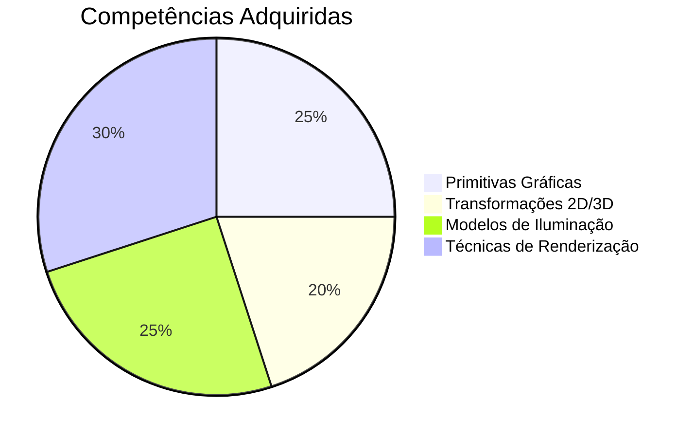

# 🎨 Computação Gráfica - Exercícios Práticos

Repositório contendo implementações de algoritmos fundamentais e técnicas avançadas de CG, desenvolvidos durante a disciplina.

## 🌟 Destaques
- Implementação de algoritmos clássicos (Bresenham, Ray Tracing)
- Pipeline gráfico completo (2D → 3D → Renderização)
- Modelos avançados de iluminação e sombreamento
- Projetos interativos com OpenGL/WebGL

## 🎯 Habilidades Desenvolvidas



### Domínios Técnicos
✔️ Pipeline gráfico completo  
✔️ Matemática para CG (álgebra linear, geometria)  
✔️ Otimização de algoritmos gráficos  
✔️ Desenvolvimento com bibliotecas modernas (OpenGL, Three.js)  

## 🏗️ Estrutura do Projeto

### 1. Fundamentos
- `/primitivas/` → Algoritmos de rasterização (Bresenham, Midpoint)
- `/transformacoes/` → Matrizes de transformação 2D/3D
- `/colorizacao/` → Modelos de cor RGB/HSV/CMYK

### 2. Técnicas Avançadas
```bash
/projetos/
   ├── iluminacao/       # Phong, Gouraud
   ├── ray-tracing/      # Path tracing básico
   └── shaders/          # GLSL/HLSL
```

### 3. Ferramentas Utilizadas
| Tecnologia | Aplicação |
|------------|-----------|
| OpenGL | Renderização 3D |
| GLFW | Criação de janelas |
| GLM | Matemática gráfica |
| ImGui | Interfaces |

## ⚙️ Configuração

### Pré-requisitos
- Compilador C++17 (g++/clang)
- OpenGL 4.6+
- CMake 3.20+

```bash
# Linux
sudo apt install libglfw3-dev libglm-dev

# Windows (vcpkg)
vcpkg install glfw3 glm
```

### Compilação
```bash
mkdir build && cd build
cmake ..
make -j4
```

## 🚀 Exemplos de Código

### Transformação 3D
```cpp
glm::mat4 model = glm::mat4(1.0f);
model = glm::rotate(model, glm::radians(45.0f), glm::vec3(0.0f, 1.0f, 0.0f));
model = glm::scale(model, glm::vec3(2.0f));
```

### Shader Básico
```glsl
#version 460 core
out vec4 FragColor;

void main() {
    FragColor = vec4(1.0, 0.5, 0.2, 1.0); 
}
```
